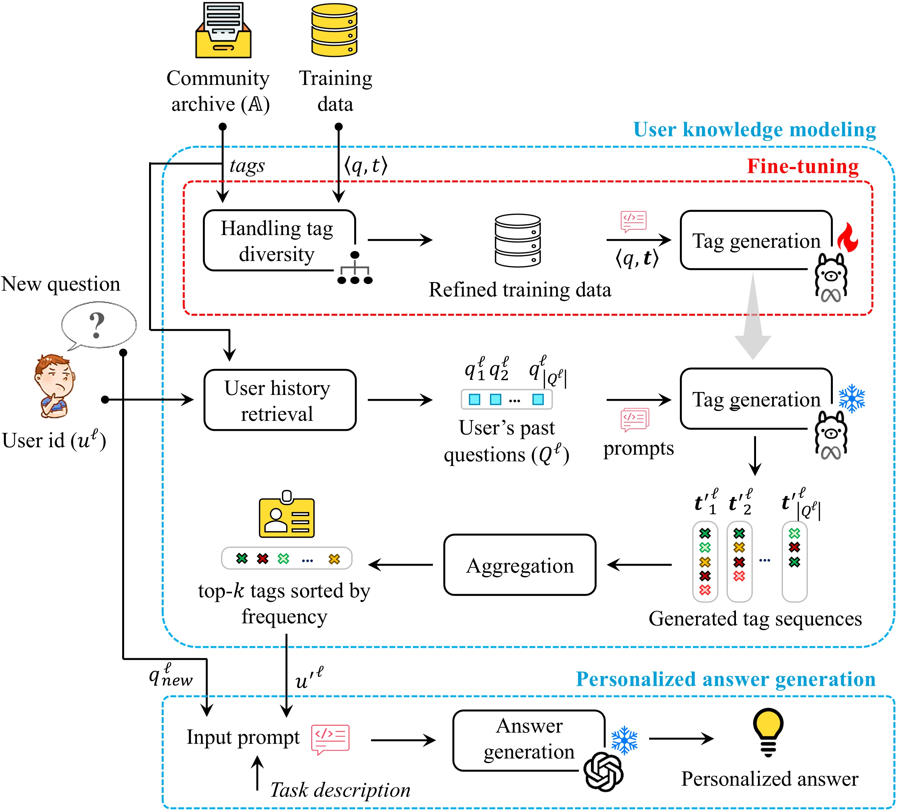

# **Enhancing Q&A Communities with Knowledge-Augmented Generation: An LLM-Based Framework for Fast and Accurate Responses**

<b> Fig 1. </b> Overview of the proposed knowledge-augmented generation approach

